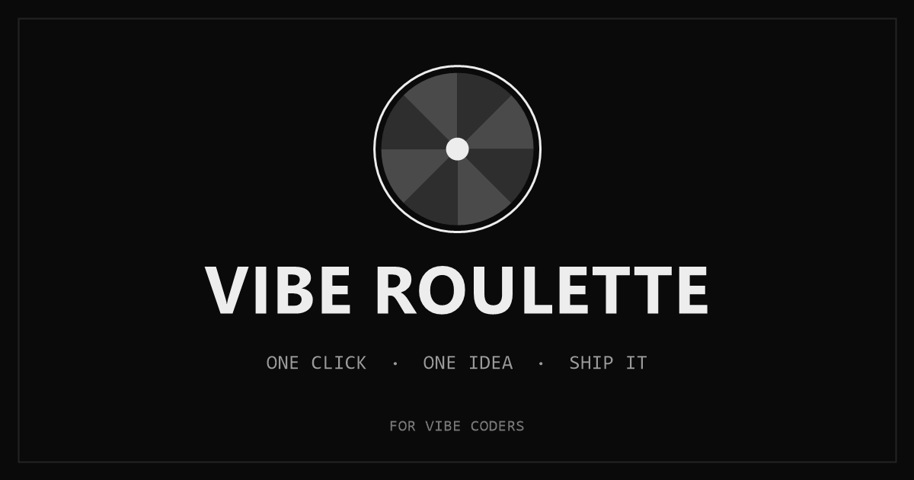

# Vibe Roulette

One click decides what you build next.

**Live:** https://viberoulette.lol

A one-button idea generator for people who ship software fast and stall on the question
"what should I build next?" Click once, get a niche plus a product type, assembled into
a single sentence specific enough to start building tonight. No login, no ads,
cookieless audience measurement (Vemetric, EU-hosted).



## Use it

- Click **Spin** (or press spacebar) and read the result.
- Toggle **twists** on/off to add or drop the third constraint line.
- Toggle **sound** on/off for the slot-machine ticks.
- Everything (spin count, toggles) stays in your browser's `localStorage`. Nothing
  leaves your device.

## Make it yours

The whole generator is three string arrays. Fork the repo and edit them:

- `src/data/niches.ts` — audiences (`'dog groomers'`, `'D&D dungeon masters'`, …)
- `src/data/products.ts` — software shapes (`'an AI voice agent'`, …)
- `src/data/twists.ts` — optional constraints, layered on top when twists are on

Draws come from a shuffle bag (`src/lib/shuffleBag.ts`), so repeats are rare until the
pool is exhausted. The sentence is assembled in `src/lib/sentence.ts`
(`"<Product> for <niche> — <twist>."`). Spin timings live in `src/hooks/useRoulette.ts`
(1.15s / 1.65s / 2.05s stagger). Colors and type live in `src/index.css` and
`DESIGN.md` — grayscale only, Space Grotesk + IBM Plex Mono, both self-hosted.

## Project structure

```
src/
  App.tsx                 page shell, header/footer, #legal routing
  components/             ResultBoard, SpinButton, LegalOverlay
  data/                   niches, products, twists, legal
  hooks/useRoulette.ts    spin state machine, timers, persistence
  lib/                    shuffleBag, sentence, audio, favicon
public/                   favicon, og image, self-hosted fonts
```

Zero runtime dependencies — just `react` and `react-dom` plus `@vemetric/react`
for cookieless analytics. Lint with `oxlint`, types with `tsc`.

## Run it

```sh
pnpm install
pnpm dev      # local dev
pnpm build    # typecheck + static build into dist/
pnpm preview  # serve the production build
```

## Deploy

Hosted on [Vercel](https://vercel.com) at https://viberoulette.lol — every push to
`main` redeploys automatically. The `/api/stats` serverless function needs the
`VEMETRIC_API_KEY` env var; the frontend needs `VITE_VEMETRIC_TOKEN` (see
`.env.example`). Any static host works too, but the public counters require a
host that can run the `/api/stats` proxy.

## Docs

- `PRODUCT.md` — what it is, who it is for, non-goals
- `DESIGN.md` — visual system, motion, accessibility floor

Built by [@kxrbx](https://x.com/kxrbx). MIT — fork it, reskin it, feed it your
own niches.
